title: Stuffing your vector tiles full of data
author:
  name: Robert Nordan
  twitter: robpvn
  url: https://github.com/Norkart
theme: Norkart/cleaver-theme
--
#Stuffing your vector tiles full of data
We do it so that you <s>don't have to</s> can do it too!

--
#Mapbox vector tiles in a minute (If you know a bit already)
 - Vector data smartly compressed into tiles.
 - Designed by Mapbox, adopted by many others.
 - Promises a lot of nice interactivity clientside & reduced data transmission

-- 
#Norwegian maps in a minute (or maybe three)
 - Interesting geography
 - The Norwegian Mapping Authority collects a lot of data
  
--
#"I got an award for Norway"

"Geirangerfjord (6-2007)" by I, Fgmedia. Licensed under CC BY 2.5 via Wikimedia Commons

--
#Far, far away
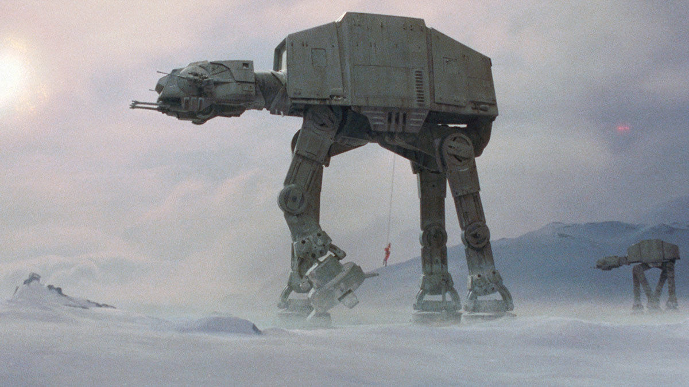
"Star Wars Episode V" - Fair use

--
#Seoul gives us an inferiority complex
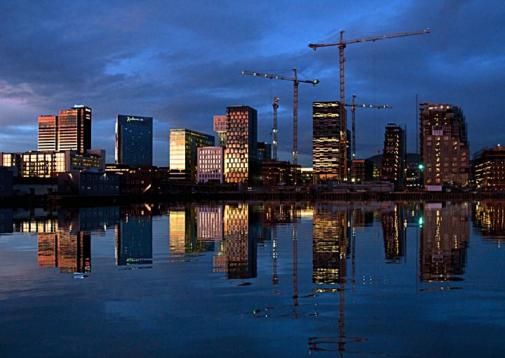
"LHR-111019-29liten" by Leif-Harald Ruud. Licensed under CC BY-SA 3.0 via Wikimedia Commons
--
#Modalen
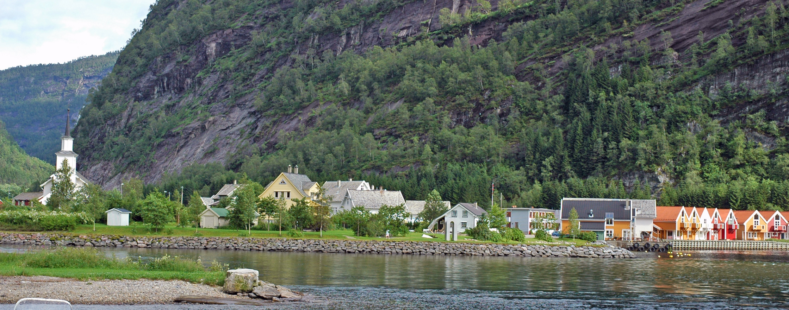
«Mo 2» av I, Efarestv. Licensed under CC BY-SA 3.0 via Wikimedia Commons

--
#Modalen (Google)
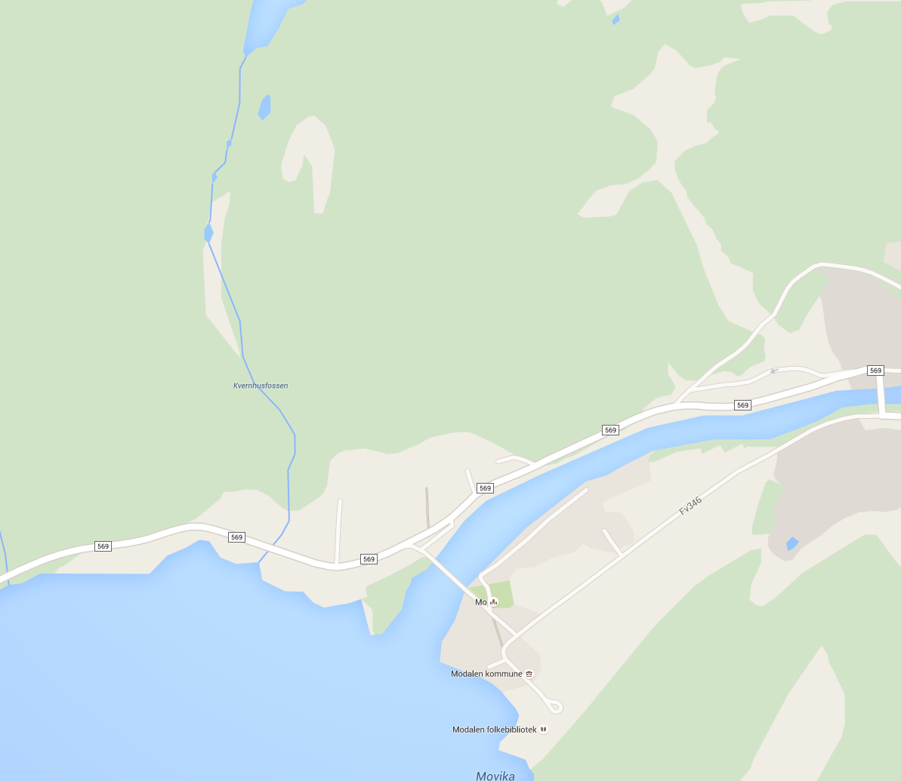

--
#Modalen (OSM)
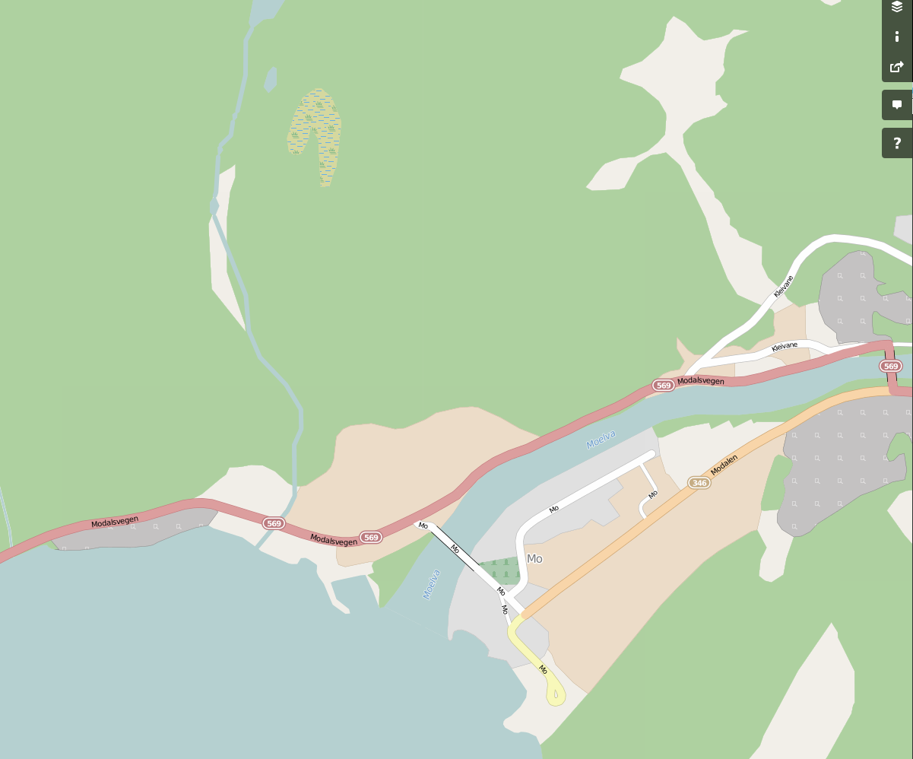

--
#Modalen (Norkart)
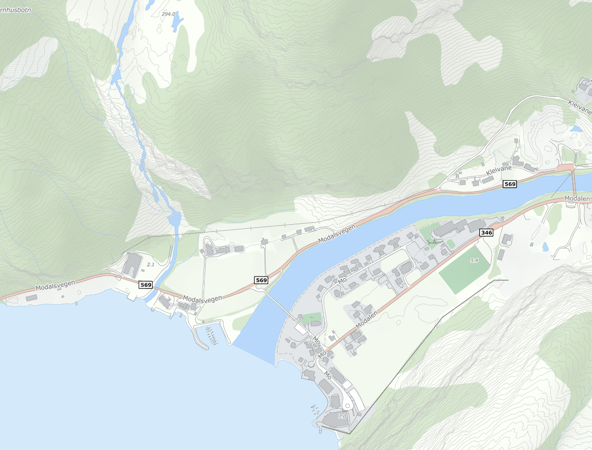

--
#Modalen up close
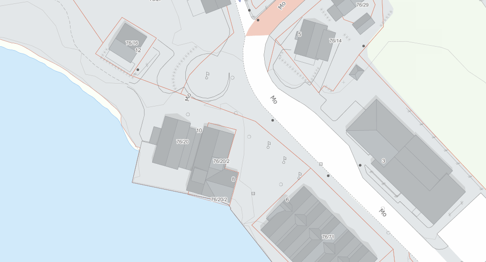

--
#A lot of details!

 - ~450 layers in all
 - Many only have data at high zoom levels

--
#Anyway, vector tiles!

 - Data definition 
  - What data to have available at each Z 
 - Style definition
  - How to display the data available

--
#Our pipeline

 - Data in PostGIS & SLD files
 - Use SLD as source
 - Create a Mapbox Studio YML & Mapnik XML (data def)
 - Tilelive.js to render into vector mbtiles
 - Serve and style clientside (style def)
 
--
#Zoom levels

 - Vector tiles usually only go to Z16, then overzoom
 - We have lots of Z>16 stuff
 - Put it in Z16 and use style to reveal >16
 
--
#Tile size limits

 - 500KB per tile is a hard limit
 - Combined with everything in Z16 you have a challenge

--
#Never use `SELECT *`

 - Usually `SELECT geom` is enough
 - Only add the attributes you really need for styling

--
#Generalisation choices

 - Mapbox likes Tippecanoe
 - We had a database with data generalised for different scales
  - Handcrafted and in use in our raster maps

--
#Keep the originals!

Think of vector tiles as lossy compression for display rather than a data format.

--
#The spec vs. best/general practice

 - Z16 and 500 KB limits are not in the spec!
 - Mapbox just configures all their stuff like that
 - Why fight against it?

--
#Making Mapbox Studio beg for mercy

 - Wanted to inspect in MBS, but:
 - Opening projects with 200+ layers takes a _long_ time, 450 layers is instacrash
 - We created mapnik xmls and generated vector mbtiles directly with tilelive, then used them as source in MBS to inspect

--
#Generation times

 - Not magically faster than raster tiles (same amount of work)
 - SSDs help a lot!
 - Test scanline vs. pyramid strategies for your bbox!

--
#File sizes
 - Magically smaller than raster tiles!
   - From X TB to XXX GB
 - The big trick is limiting it to Z16
  - Generating Z16 takes more time and space than the first 15 combined

--
#Converting styles from SLD
 - Mapbox says to create GL styles from scratch
 - We didn't listen, deployed the power of summer interns
 - Machine-converted styles make for good starting point, need a lot of tweaking
   - Redundant data that used to be painted over
   - Rendering order
   - Seperate style rules for the same geometry (differing in zoom)

--
#Original (raster)
 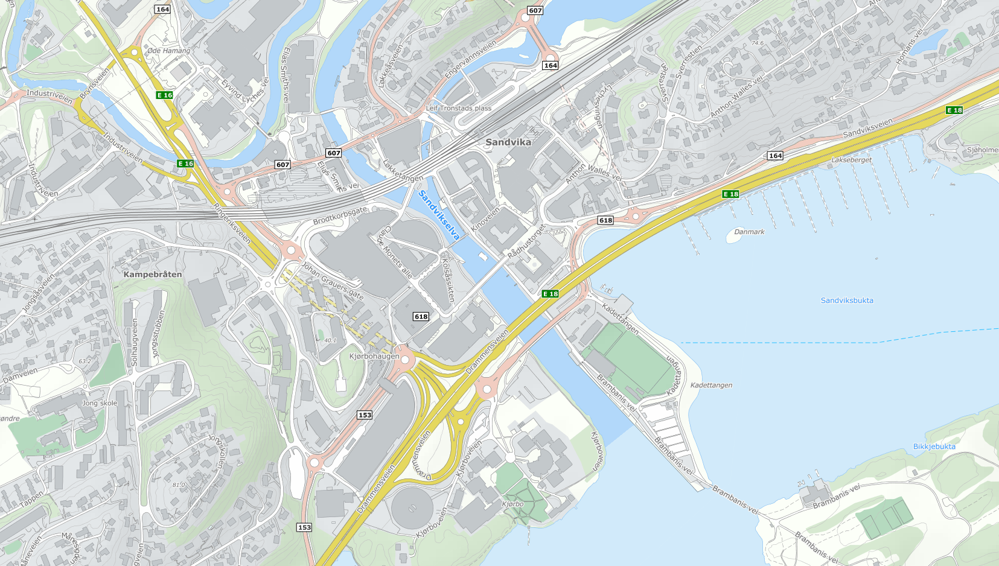

--
#Results (MapboxGL JS)
 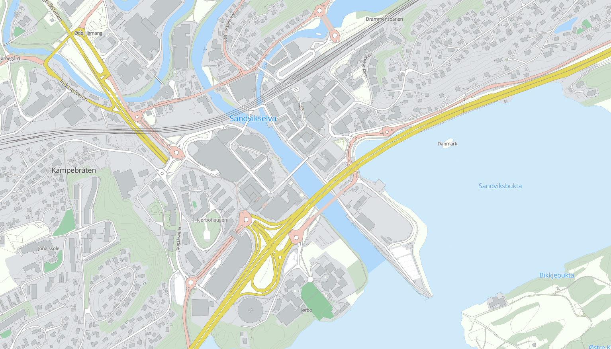
 
--
#Results (MapboxGL JS)
 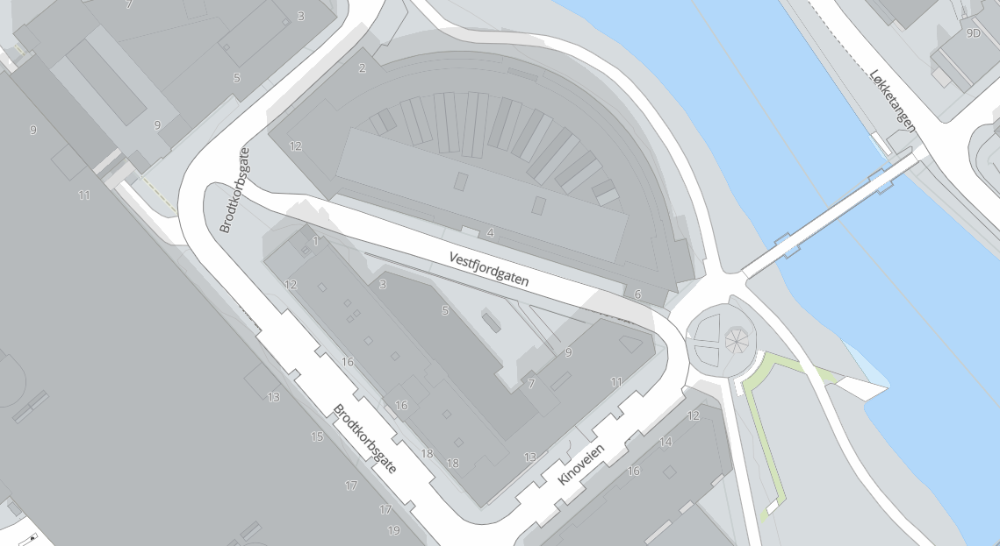
 
--
#Results (Mapbox GL Native - Android)
 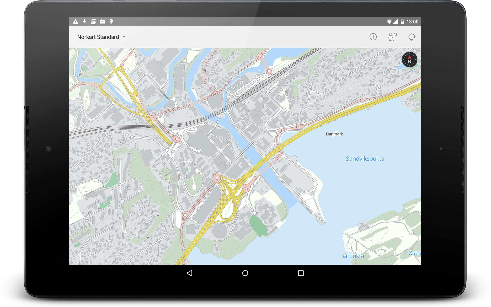
 
--
#Results (Live?)
 [Special bonus!](http://norkart.github.io/foss4g-2015-stuffing-vtiles/example.html)

